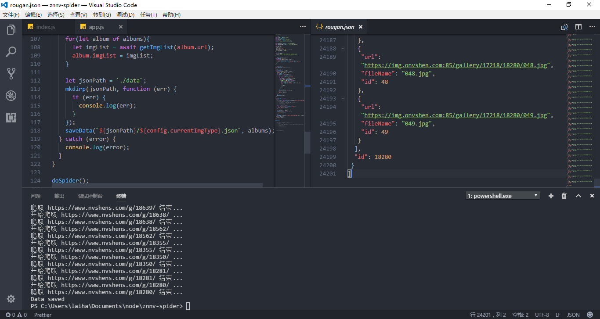

# beauty-spider
## what
一个用于爬取`www.nvshens.com`上妹子图片的爬虫，如有侵权，马上关闭
   
## why
一张张下实在太麻烦了

## usage
```
0. node -v >= 7.6
1. git clone https://github.com/laihaibo/beauty-spider.git
2. npm i
3. npm run start (爬取相册图片链接，并保存为json)
4. npm run calc (获取爬取的相册数和文件数)
5. npm run download (下载图片文件)
```

## update
### against反爬虫  
图片下载完之后会发现变成了盗链图片。于是观察浏览器正常浏览行为。在请求头中设置`referer`, `accept`和`user-agent`。解决该问题
```
request.get(url).set({
        'Referer': 'https://www.google.com',
        'Accept': 'image/webp,image/*,*/*;q=0.8',
        'User-Agent': 'Mozilla/5.0 (Windows NT 10.0; Win64; x64) AppleWebKit/537.36 (KHTML, like Gecko) Chrome/60.0.3091.0 Safari/537.36'
      }).end((err, res) => {})
```
### 断线继续下载   
图片下载700个文件时，经常断线。应该是网站的饭爬虫机制起了作用，暂时无法解决。重新下载时理应跳过已经下载的文件。于是在保存图片时会先判断图片是否存在。
```
let isExit = fs.existsSync(path);
if (!isExit) {
  saveOne(...args)
}
```
### 获取理应下载的相册数和文件数
```
let data = JSON.parse(fs.readFileSync(path));

let count = data.reduce((prev, cur) => prev + cur.imgList.length, 0);

console.log(`共${data.length}个相册，共${count}张图片`);
```
## how
1. 引入所需的库
```
const fs = require("fs");
const mkdirp = require('mkdirp');
const cheerio = require('cheerio');
const request = require('superagent');
require('superagent-charset')(request);
```

2. 页面分析，配置config文件   
分析相册地址，以`韩国`这个标签为例，首页为`https://www.nvshens.com/gallery/hanguo/`,
第二页为`https://www.nvshens.com/gallery/hanguo/2.html`
```
const config = {
  currentImgType: 'hanguo',
  allImgType: {
    rougan: `https://www.nvshens.com/gallery/rougan/`,
    hanguo: 'https://www.nvshens.com/gallery/hanguo/'
  }
}
```

3. 封装获取指定url的html内容函数
```
//该网站编码为utf-8
const getHtml = url => {
  return new Promise((resolve, reject) => {
    request.get(url).charset('utf-8').end((err, res) => {
      err ? reject(err) : resolve(cheerio.load(res.text));
    })
  })
}
```
4. 获取本分类下所有相册的标签
```
/**
 * @param {string} startUrl 标签首页的url地址
 */
const getAlbums = (startUrl) => {
  return new Promise((resolve, reject) => {
    let albums = [];  // 用于保存该标签的所有相册信息

    let getQuery = async startUrl => {
      try {
        let $ = await getHtml(startUrl);
        let pages = $('#listdiv .pagesYY a').length;  // 获取页数

        for (let i = 1; i <= pages; i++) {
          let pageUrl = `${startUrl + i}.html`  // 设置每页的url
          let $ = await getHtml(pageUrl);

          // 动态设置pages的值
          let mmm = $('#listdiv .pagesYY a').map(function (i, el) {
            return parseInt($(this).text(), 0);
          }).get().filter(x => x > 0);
          pages = mmm.length < 2 ? pages : mmm.reduce((prev, cur) => Math.max(prev, cur));

          $('.galleryli_title a').each(function () {
            albums.push({
              title: $(this).text(),
              url: `https://www.nvshens.com${$(this).attr("href")}`,
              imgList: [],
              id: parseInt($(this).attr("href").split('/')[2], 10)
            })
          })
        }

        resolve(albums);  // 返回相册信息
      } catch (error) {
        console.log(error);
      }
    }

    getQuery(startUrl);
  })
}
```

5. 获取所有相册的图片信息
```
/**
 * @param {string} startUrl 该相册首页的url地址
 */
const getImgList = (startUrl) => {
  return new Promise((resolve, reject) => {
    let albums = [];  // 存储本相册的所有图片信息

    let getQuery = async startUrl => {
      try {
        let $ = await getHtml(startUrl);
        let pages = $('#pages a').length;

        for (let i = 1; i <= pages; i++) {
          let pageUrl = `${startUrl + i}.html`
          let $ = await getHtml(pageUrl);

          $('#hgallery img').each(function () {

            let url = $(this).attr('src');  //图片地址
            let fileName = url.split('/').pop();  //文件名
            let id = parseInt(fileName.split('.')[0], 10); //id

            albums.push({
              url,
              fileName,
              id
            })
          })
        }

        resolve(albums); // 返回本相册的所有图片信息
      } catch (error) {
        console.log(error);
      }
    }

    getQuery(startUrl);
  })
}
```

6. 保存相册信息
```
/**
 * @param {string} path 保存数据的路径
 * @param {array} albums 相册信息数组
 */
const saveData = (path, albums) => {
    fs.writeFile(path, JSON.stringify(albums, null, ' '), function (err) {
        err ? console.log(err) : console.log('Data saved');
    });
}
```
7. 保存图片
```
/**
 * @param {string} title 图片所在文件夹名
 * @param {string} url 图片url
 * @param {string} fileName 图片名
 * @param {array} imgList 单个相册的图片信息
 */
// 保存一张图片
const saveOne = (title, url, fileName) => {
  return new Promise((resolve, reject) => {
    let path = `./img/${currentImgType}/${title}/${fileName}`;
    request.get(url).end((err, res) => {
      if (err) {
        console.log(`Error: ${err} in getting ${url}`)
      }
      fs.writeFile(path, res.body, function (err) {
        if (err) console.log(`Error: ${err} in downloading ${url}`)
      });
      resolve();
    })
  })
}

//保存一个相册下的多张图片
const saveImg = ({title,imgList}) => {
  // 创建文件夹
  mkdirp(`./img/${currentImgType}/${title}`, function (err) {
    if (err) {
      console.log(`Error: ${err} in makedir ${title}`);
    }
  });

  let getQuery = async() => {
    try {
      for (let {url,fileName} of imgList) {
        await saveOne(title, url, fileName);
      }
    } catch (error) {
      console.log(error);
    }
  }

  // 打印下载一个相册所需时间
  console.time(`download ${title}...`)
  getQuery();
  console.timeEnd(`download ${title}...`)
}
```

8. 执行爬虫

```
const doSpider = async() => {
  try {
    // 获取相册信息
    let albums = await getAlbums(allImgType[currentImgType]);

    // 获取每张图片信息
    for (let album of albums) {
      let imgList = await getImgList(album.url);
      album.imgList = imgList;
    }

    // 保存json
    let jsonPath = `./data`;
    mkdirp(jsonPath, function (err) {
      if (err) {
        console.log(`Error: ${err} in makedir of Json`);
      }
    });
    saveData(`${jsonPath}/${currentImgType}.json`, albums);

    // 保存图片
    for (let value of albums) {
      saveImg(value)
    }

  } catch (error) {
    console.log(error);
  }
}
```

## experience
1. 有些坑如果不踩过一遍是不会吐血的，比如cheerio的操作和fs的操作
2. just do it

## Thanks
本文有参考`nieheyong`的[HanhandeSpider](https://github.com/nieheyong/HanhandeSpider)和其他的爬虫文章，得到很多启发